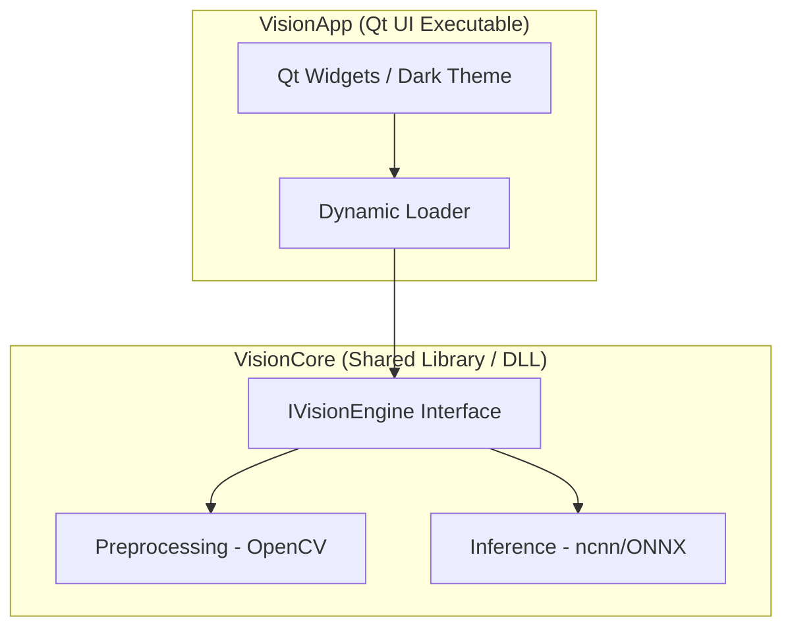

# VisionStudio — Implementation Plan

## Overview
Build a cross-platform OCR & Image Processing application from scratch per MASTER_PLAN.md.

**Tech Stack:** C++17, Qt 6, OpenCV 4, ncnn/ONNX Runtime, vcpkg, CMake

## Architecture



## Folder Structure
```
VisionStudio/
├── CMakeLists.txt              # Root CMake
├── CMakePresets.json            # OBS-style presets
├── vcpkg.json                  # vcpkg manifest
├── src/
│   ├── VisionCore/             # Shared library
│   │   ├── CMakeLists.txt
│   │   ├── include/
│   │   │   └── VisionCore/
│   │   │       ├── Export.h
│   │   │       ├── IVisionEngine.h
│   │   │       ├── VisionEngine.h
│   │   │       └── ImageProcessor.h
│   │   └── src/
│   │       ├── VisionEngine.cpp
│   │       └── ImageProcessor.cpp
│   └── VisionApp/              # Qt executable
│       ├── CMakeLists.txt
│       ├── include/
│       │   └── VisionApp/
│       │       ├── MainWindow.h
│       │       ├── ImageViewer.h
│       │       └── LogConsole.h
│       ├── src/
│       │   ├── main.cpp
│       │   ├── MainWindow.cpp
│       │   ├── ImageViewer.cpp
│       │   └── LogConsole.cpp
│       └── resources/
│           ├── app.qrc
│           └── styles/
│               └── dark_theme.qss
├── tests/
│   ├── CMakeLists.txt
│   ├── data/                   # Test images
│   └── test_image_processor.cpp
├── build/                      # Generated (not in source)
├── bin/                        # Generated (not in source)
└── lib/                        # Generated (not in source)
```

## Build Order

### Step 1: Root CMake + vcpkg + Presets
- `CMakeLists.txt` — root project, add subdirectories
- `CMakePresets.json` — OBS-style with platform-specific generators
- `vcpkg.json` — manifest for OpenCV, Qt, ncnn, GTest

### Step 2: VisionCore (Shared Library)
- `Export.h` — DLL export/import macros
- `IVisionEngine.h` — Abstract interface
- `ImageProcessor.h/cpp` — OpenCV preprocessing
- `VisionEngine.h/cpp` — Concrete implementation + factory function

### Step 3: VisionApp (Qt UI)
- `MainWindow` — Main window with toolbar, image viewer, log console
- `ImageViewer` — Image display widget with zoom/pan
- `LogConsole` — Real-time log output from VisionCore
- `dark_theme.qss` — Modern dark stylesheet
- `main.cpp` — Entry point, dynamic loading of VisionCore

### Step 4: Tests
- GTest-based unit tests for ImageProcessor
- Python regression script placeholder

## Key Design Decisions
1. **LGPLv3 Compliance**: VisionApp links to VisionCore via abstract interfaces only
2. **Dynamic Loading**: VisionCore loaded at runtime via `QLibrary` / `dlopen`
3. **Zero-Junk Build**: All intermediates routed to `build/[platform]/temp`
4. **Cross-platform**: No Win32/Mac-only APIs — Qt + standard C++ wrappers throughout
