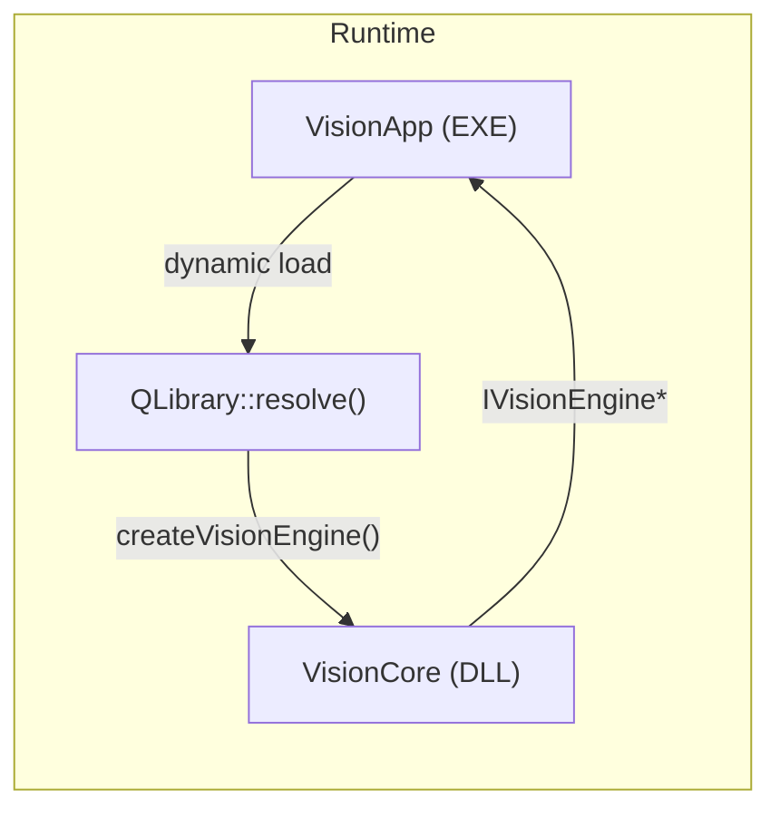

# VisionStudio — Project Walkthrough

## ✅ All Files Created

```
VisionStudio/
├── .gitignore
├── CMakeLists.txt                          # Root CMake project
├── CMakePresets.json                       # OBS-style build presets (Win/Mac/Linux)
├── vcpkg.json                              # Dependency manifest
├── MASTER_PLAN.md                          # Original requirements
│
├── src/
│   ├── VisionCore/                         # Shared Library (DLL/dylib/so)
│   │   ├── CMakeLists.txt
│   │   ├── include/VisionCore/
│   │   │   ├── Export.h                    # Cross-platform DLL macros
│   │   │   ├── IVisionEngine.h             # Abstract interface (LGPLv3 boundary)
│   │   │   ├── VisionEngine.h              # Concrete implementation
│   │   │   └── ImageProcessor.h            # OpenCV preprocessing
│   │   └── src/
│   │       ├── VisionEngine.cpp            # Lifecycle, OCR dispatch, logging
│   │       └── ImageProcessor.cpp          # Grayscale, threshold, perspective, blur
│   │
│   └── VisionApp/                          # Qt Executable
│       ├── CMakeLists.txt
│       ├── include/VisionApp/
│       │   ├── MainWindow.h                # Top-level window
│       │   ├── ImageViewer.h               # Zoom/pan image display
│       │   └── LogConsole.h                # Colour-coded log widget
│       ├── src/
│       │   ├── main.cpp                    # Entry point + QSS loader
│       │   ├── MainWindow.cpp              # Dynamic DLL loading, menus, toolbar
│       │   ├── ImageViewer.cpp             # QGraphicsView with BGR→RGB
│       │   └── LogConsole.cpp              # Timestamped, severity-colored output
│       └── resources/
│           ├── app.qrc                     # Qt resource collection
│           └── styles/dark_theme.qss       # Premium dark indigo theme
│
└── tests/
    ├── CMakeLists.txt                      # GTest integration
    ├── test_image_processor.cpp            # 7 unit tests
    ├── regression_test.py                  # Python OCR accuracy script
    └── data/README.md                      # Test data placeholder
```

## Architecture



> [!IMPORTANT]
> VisionApp interacts with VisionCore **exclusively** through `IVisionEngine` (abstract interface). This ensures LGPLv3 compliance — the UI can be proprietary while the engine remains open-source.

## Key Design Decisions

| Decision | Rationale |
|---|---|
| `extern "C"` factory function | Enables `QLibrary`/`dlopen` dynamic loading without C++ name mangling |
| Thread-safe `VisionEngine` | `std::mutex` + `std::atomic_bool` — preprocessing can run on worker threads |
| BGR→RGB in `ImageViewer` | OpenCV uses BGR; Qt uses RGB. Conversion happens at the display boundary |
| Log callback via `QMetaObject::invokeMethod` | Thread-safe cross-thread UI updates without manual signal/slot |
| Adaptive threshold (not global) | Far more robust for document OCR with uneven lighting |

## Build Instructions

### Prerequisites
- **CMake 3.21+**
- **vcpkg** bundled as Git submodule at `third-party/vcpkg/` (auto-cloned with `git clone --recursive`)
- **Visual Studio Community 2022** (Windows) or **Xcode** (macOS) or **GCC + Ninja** (Linux)

> No `VCPKG_ROOT` environment variable needed — the toolchain file is at `${sourceDir}/third-party/vcpkg/scripts/buildsystems/vcpkg.cmake`.

### Configure & Build (Windows)
```powershell
# Configure
cmake --preset windows-x64

# Build
cmake --build --preset windows-debug
# or
cmake --build --preset windows-release
```

### Configure & Build (macOS)
```bash
cmake --preset macos-arm64
cmake --build --preset macos-debug
```

### Output Locations
| Artifact | Path |
|---|---|
| Executable | `bin/Debug/VisionStudio.exe` |
| VisionCore DLL | `bin/Debug/VisionCore.dll` |
| Libraries | `lib/Debug/` |
| Build intermediates | `build/windows-x64/` |

## What's Ready Now vs. TODO

| Feature | Status |
|---|---|
| Project structure & CMake | ✅ Complete |
| Cross-platform export macros | ✅ Complete |
| IVisionEngine abstract interface | ✅ Complete |
| Image loading & display | ✅ Complete |
| Grayscale / Threshold / Perspective / Blur | ✅ Complete |
| Dark theme Qt UI | ✅ Complete |
| Dynamic DLL loading | ✅ Complete |
| Log Console | ✅ Complete |
| Zoom/Pan image viewer | ✅ Complete |
| GTest unit tests (7 tests) | ✅ Complete |
| Python regression script | ✅ Complete |
| OCR inference (ncnn/ONNX) | ⏳ Placeholder — needs model files |
| Multi-threaded frame processing | ⏳ Architecture ready, needs `QThread` worker |
